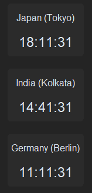

# py_clocks

The `py_clocks` package is a Python-based project designed for displaying multiple timezone clocks on a Windows desktop.

By default, the app shows the time in the following timezones:
- **Asia/Tokyo**
- **Asia/Kolkata**
- **Europe/Berlin**



*Screenshot of the `py_clocks` application showing multiple timezone clocks.*

To customize the timezones displayed, modify the `py_clocks.py` file by adding or removing timezones as needed.

---

## Prerequisites

- Python (version 3.11 or higher is recommended)
- The `uv` package (used for dependency management)

---

## Building the Project

Follow these steps to build and run the project:

1. **(Optional)** Install the `uv` package if it is not already installed:
    ```powershell
    pip install uv
    ```

2. **Install the required dependencies**:
    ```powershell
    uv sync
    ```

3. **Run the project**:
    ```powershell
    .venv/Scripts/python.exe -m py_clocks
    ```

---

## Creating an Executable

To create a standalone executable for the `py_clocks` package using `pyinstaller`, follow these steps:

1. **Generate the executable**:
    ```powershell
    .venv/Scripts/pyinstaller.exe --onefile --noconsole py_clocks.py
    ```

2. **Locate the executable**:
   The generated executable will be located in the `dist` directory.

---

## Troubleshooting

- **Missing Dependencies**: If you encounter issues with missing dependencies, ensure you have run `uv sync` to install all required packages.
- **Python Version**: Ensure you are using Python 3.11 or higher.
- **Executable Issues**: If the executable does not run, verify that all required files (e.g., timezone data) are included in the build.

---

## License

This project is licensed under the MIT License. See the `LICENSE` file for details.
